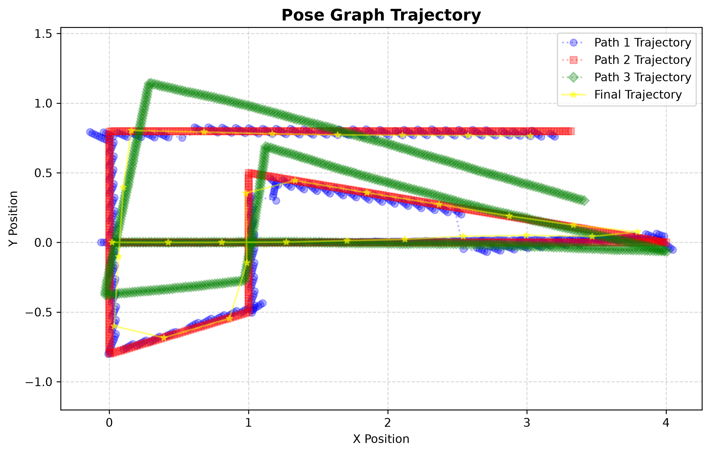
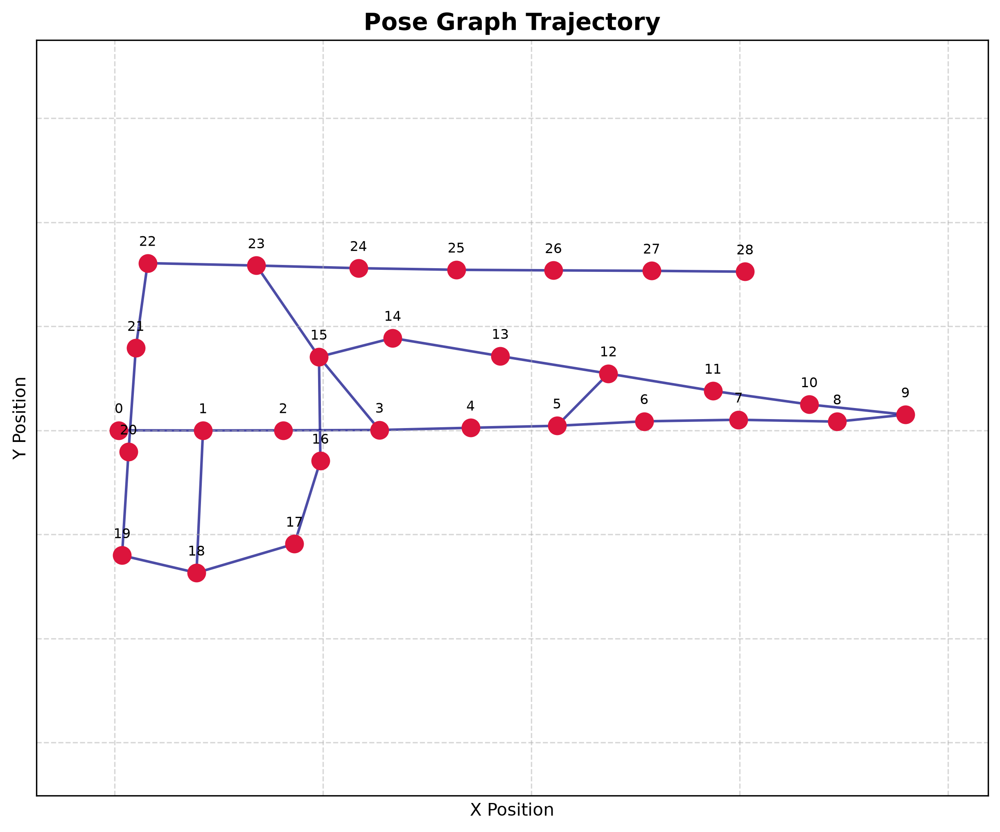

# Vadimych1's Graph SLAM
ICP-based SLAM with g2o graph optimization and robust loop closuring

### Demo
Trajectories (red - real, green - noisy odometry, blue - SLAM-based trajectory, yellow - final optimized pose graph)

Optimized pose graph with loop closures

### Tuning
|parameter|description|default value|
|---------|-----------|-------------|
|**Graph optimization**|
|dxy_var: float|position variance. increase if odometry is bad|0.2| 
|dtheta_var: float|heading variance. increase if odometry is bad|np.deg2rad(3)|
|**Loop closure**|
|min_chain_size: int|minimum topological distance from last vertex for other vertex to take part in loop closuring. increasing this will make sparser loops|5| 
|loop_closure_max_dist: float|max loop searching distance. increasing this can make more loops but they can be worse in quality. may decrease performance|0.7|
|loop_accept_fitness: float|point cloud overlap threshold for making loop in fine search. decreasing this will make more loops with significantly lower loop quality|0.7|
|coarse_search_max_candidates: int|increasing will search for more coarse candidates. loop closure could be better. increases compute time|5|
|**Vertices and sub-vertex estimation**|
|min_distance_to_vertex: float|min distance from previous vertex to create a new one|0.4|
|min_angle_to_vertex: float|min angle delta from previous vertex to create a new one|np.deg2rad(10)|
|min_distance_to_subvertex: float|min distance from previous sub-vertex to make a new ICP estimation|0.08|
|min_angle_to_subvertex: float|min angle delta from previous sub-vertex to make a new ICP estimation|np.deg2rad(5)|
|max_scans_no_subvertex: float|max amount of scans odometry-only scans in a row before sub-vertex estimation|7|
|vertex_accept_fitness: float|point cloud overlap threshold for making a new vertex. decreasing this could make more vertices with lower quality|0.6| 
|vertex_rmse_tolerance: float|max RMSE between scans for vertex to be accepted|0.2|
|**Keyframe matching**|
|keyframe_match_distance_tolerance: float|max distance deviation between ICP-estimated and odometry-estimated transforms between two vertex keyframes|0.15|
|keyframe_match_angle_tolerance: float|max angle difference between ICP-estimated and odometry-estimated transforms between two vertex keyframes|np.deg2rad(5)|
|**ICP**|
|matcher_max_correspondence_distance: float|max point correspondence distance|0.5|
|matcher_mode: str|ICP mode, one of: 'ICP', 'GICP', 'PLANE_ICP'|"GICP"|
|**debugging**|
|verbose: bool|log useful data|True|